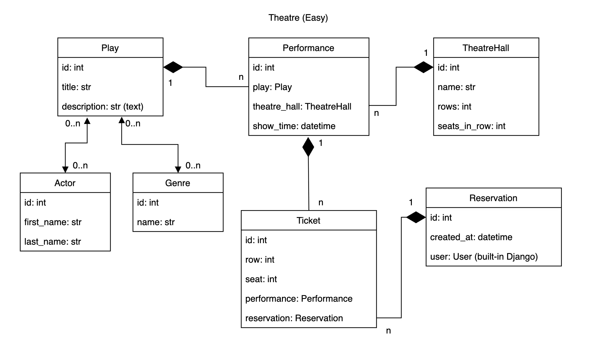
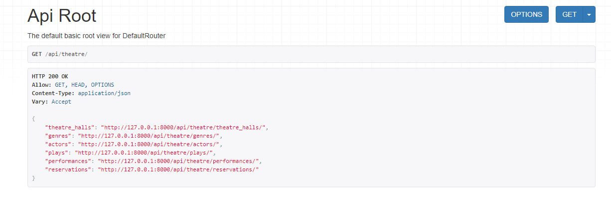
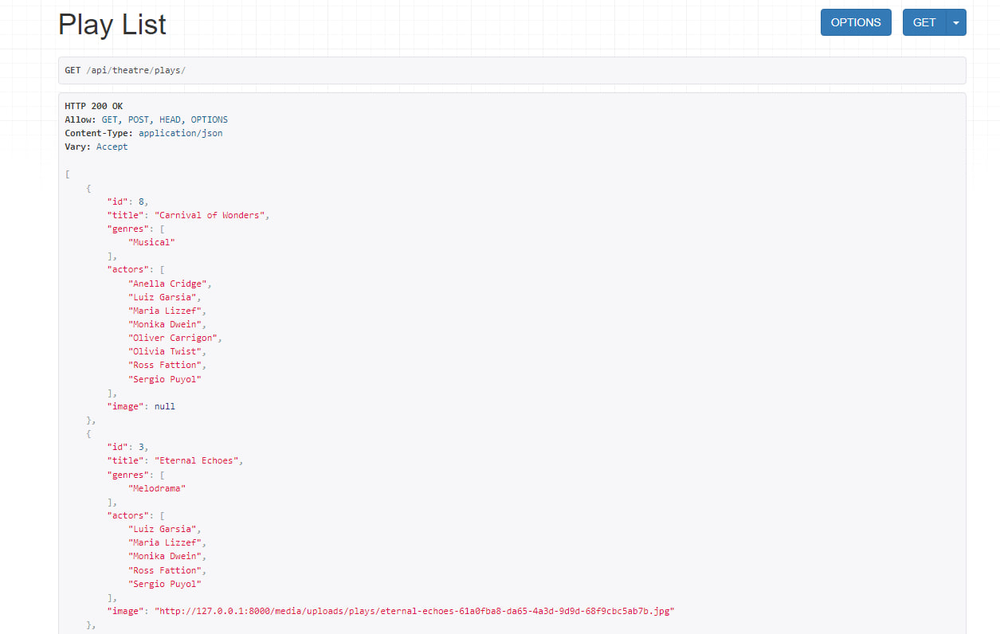
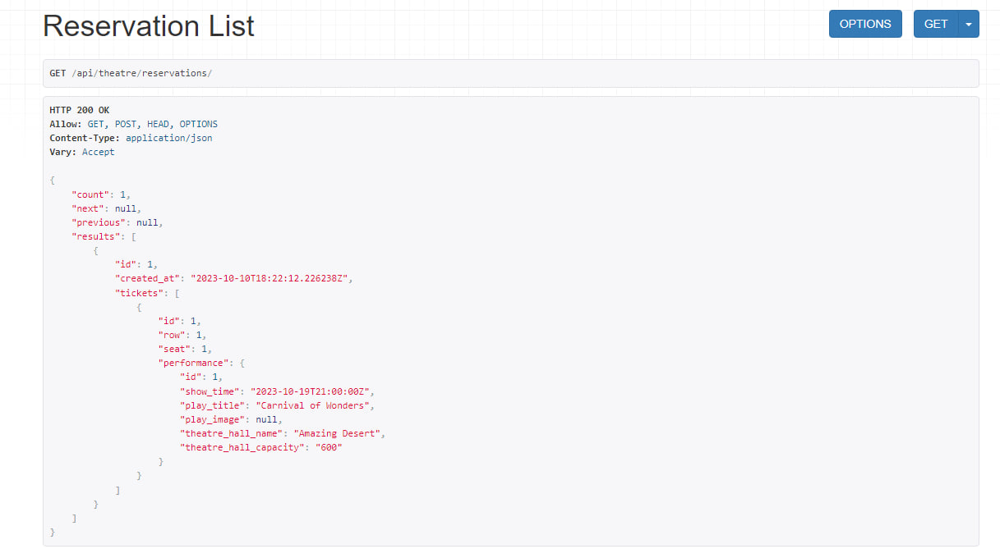

# Theatre API Service

Theatre API Service is an API for managing theatre plays, theatre halls and
reservation tickets for performances.

## Features
* Play Management
* Performance scheduling
* Reservation system
* Admin panel and User authentication
* Pagination and Filtering
* Docker support
* Swagger API documentation

## Installation
1. Clone the repository
```
https://github.com/artur-leleiko/theatre-api-service.git
```

2. Navigate to the project directory
```
cd theatre-api-service
```

3. Create an .env file and define the environment variables using .env.sample
4. Build Docker container
```
docker-compose build
```

5. Start the Docker container
```
docker-compose up
```

## API Endpoints
```
"theatre" : 
                "http://127.0.0.1:8000/api/theatre/genres/"
                "http://127.0.0.1:8000/api/theatre/actors/"
                "http://127.0.0.1:8000/api/theatre/plays/"
                "http://127.0.0.1:8000/api/theatre/theatre-halls/"
                "http://127.0.0.1:8000/api/theatre/performances/"
                "http://127.0.0.1:8000/api/theatre/reservations/"
"user" : 
                "http://127.0.0.1:8000/api/user/register/"
                "http://127.0.0.1:8000/api/user/me/"
                "http://127.0.0.1:8000/api/user/token/"
                "http://127.0.0.1:8000/api/user/token/refresh/"
"documentation": 
                "http://127.0.0.1:8000/api/doc/"
                "http://127.0.0.1:8000/api/swagger/"
                "http://127.0.0.1:8000/api/redoc/"
```

## DB Structure


## Screenshots



